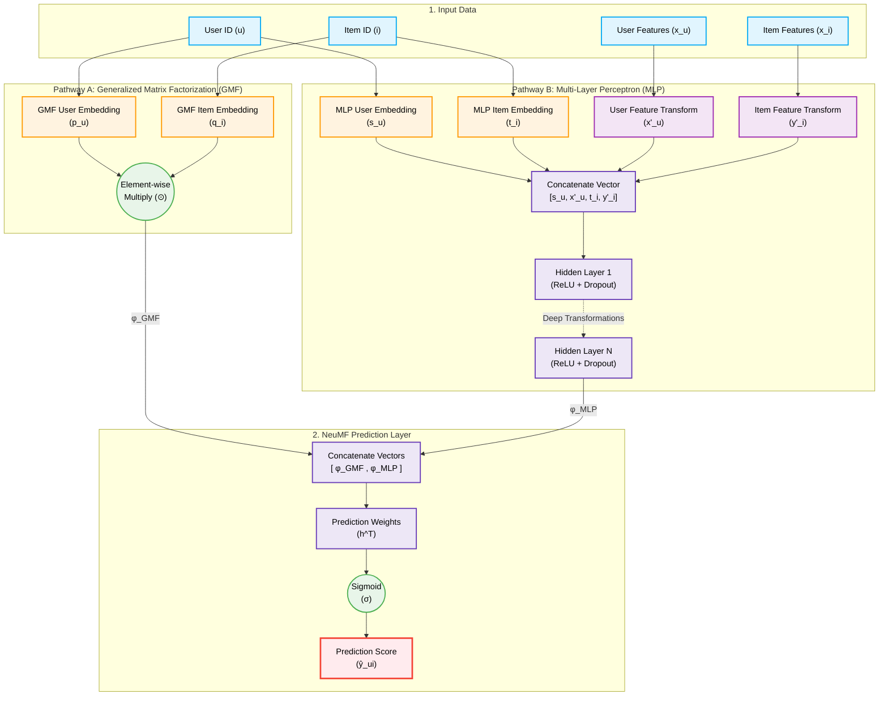

```mermaid
graph TD
    %% Styling
    classDef inputNode fill:#e1f5fe,stroke:#03a9f4,stroke-width:2px,color:#000
    classDef embedNode fill:#fff3e0,stroke:#ff9800,stroke-width:2px,color:#000
    classDef transformNode fill:#f3e5f5,stroke:#9c27b0,stroke-width:2px,color:#000
    classDef operationNode fill:#e8f5e9,stroke:#4caf50,stroke-width:2px,shape:circle,color:#000
    classDef layerNode fill:#ede7f6,stroke:#673ab7,stroke-width:2px,color:#000
    classDef outputNode fill:#ffebee,stroke:#f44336,stroke-width:3px,color:#000

    %% Inputs
    subgraph Inputs ["1. Input Data"]
        U["User ID (u)"]:::inputNode
        I["Item ID (i)"]:::inputNode
        UF["User Features (x_u)"]:::inputNode
        IF["Item Features (x_i)"]:::inputNode
    end

    %% GMF Pathway
    subgraph GMF ["Pathway A: Generalized Matrix Factorization (GMF)"]
        GMF_UE["GMF User Embedding<br>(p_u)"]:::embedNode
        GMF_IE["GMF Item Embedding<br>(q_i)"]:::embedNode
        GMF_Mul(("Element-wise<br>Multiply (⊙)")):::operationNode
        
        U --> GMF_UE
        I --> GMF_IE
        GMF_UE --> GMF_Mul
        GMF_IE --> GMF_Mul
    end

    %% MLP Pathway
    subgraph MLP ["Pathway B: Multi-Layer Perceptron (MLP)"]
        MLP_UE["MLP User Embedding<br>(s_u)"]:::embedNode
        MLP_IE["MLP Item Embedding<br>(t_i)"]:::embedNode
        UF_Trans["User Feature Transform<br>(x'_u)"]:::transformNode
        IF_Trans["Item Feature Transform<br>(y'_i)"]:::transformNode
        
        U --> MLP_UE
        I --> MLP_IE
        UF --> UF_Trans
        IF --> IF_Trans
        
        Concat["Concatenate Vector<br>[s_u, x'_u, t_i, y'_i]"]:::layerNode
        
        MLP_UE --> Concat
        MLP_IE --> Concat
        UF_Trans --> Concat
        IF_Trans --> Concat
        
        HL1["Hidden Layer 1<br>(ReLU + Dropout)"]:::layerNode
        HLN["Hidden Layer N<br>(ReLU + Dropout)"]:::layerNode
        
        Concat --> HL1
        HL1 -.->|"Deep Transformations"| HLN
    end

    %% NeuMF Integration Layer
    subgraph NeuMF ["2. NeuMF Prediction Layer"]
        FinalConcat["Concatenate Vectors<br>[ φ_GMF , φ_MLP ]"]:::layerNode
        PredLayer["Prediction Weights<br>(h^T)"]:::layerNode
        Sigmoid(("Sigmoid<br>(σ)")):::operationNode
        Output["Prediction Score<br>(ŷ_ui)"]:::outputNode
        
        GMF_Mul -->|φ_GMF| FinalConcat
        HLN -->|φ_MLP| FinalConcat
        
        FinalConcat --> PredLayer
        PredLayer --> Sigmoid
        Sigmoid --> Output
    end
```
